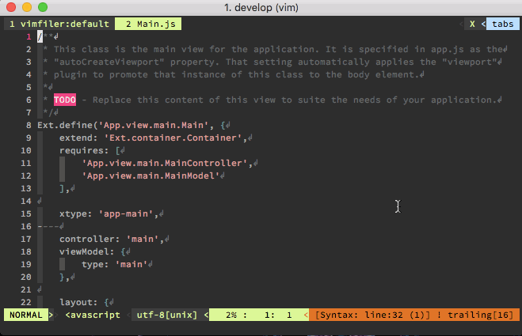

vim-sencha-util
================

sencha vim plugin

attention
================

- require python 2.7+
- require projects made with Sencha Command

install
================

    NeoBundle 'tnker/vim-sencha-util'

faetrue
================

- MVVM file toggle switch
- Jump to the corresponding file from the classpath
- Jump to the corresponding handler has been written with the view controller
- Jump to the xtype name file

### Example Application Code

    app/
    ├ model/
    ├ store/
    ├ view/
    ｜　└ main/
    ｜　　├ MainController.js
    ｜　　｜　├ onClickButton()
    ｜　　｜　└ onConfirm()
    ｜　　├ MainModel.js
    ｜　　└ Main.js
    └ Application.js

### MVVM file toggle switch

    :SenchaMVVMToggle

#### Toggle filename rule

View name as a prefix searches for each file.

    [Hoge].js
    [Hoge]Model.js
    [Hoge]Controller.js

### Jump to the corresponding file from the classpath

    :SenchaParserReadCurrentLine
    
#### Support format

- `Ext.xxx.xxx`
    - Search for standard class package.
- `Xxx.xxx.xxx`
    - Find the package that you created yourself.(under the `app` directory)

### Jump to the corresponding handler has been written with the view controller

    :SenchaParserReadCurrentLine

### Jump to the xtype name file

    :SenchaParserReadCurrentLine

support version
================

- Sencha Touch 2.x
- Sencha Ext JS 5.x
- Sencha Ext JS 6.x (In the response)

setting sample
================

    map <silent> <C-@> :SenchaMVVMToggle<CR>
    map <silent> <C-f> :SenchaParserReadCurrentLine<CR>
    
